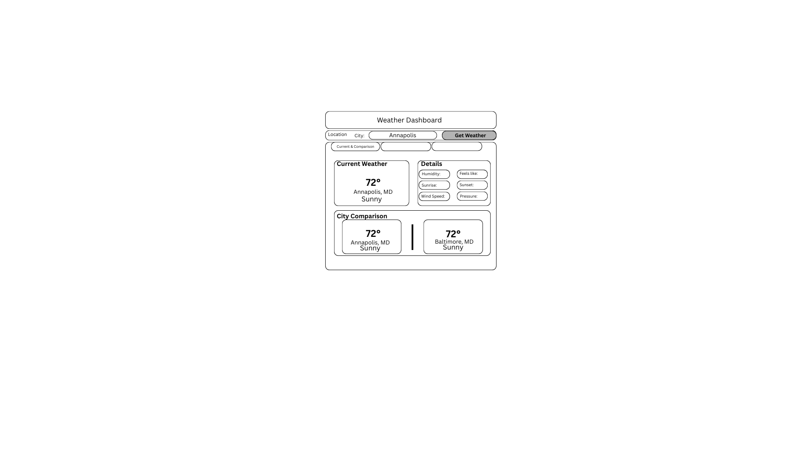

# Weather Dashboard
    A simple weather dashboard app that lets you search for a city and see the current weather using the OpenWeatherMap API. The app is built with Python and Tkinter, and saves weather data for offline use.

## Project structure 
```
Weather-Dashboard-Forde/
│
├── main.py                  # App entry point
├── config.py                # Loads API key from .env
├── .env                     # Stores your API key (not tracked by git)
├── .gitignore               # Tells git to ignore .env and other files
│
├── core/
│   ├── weather_data_collector.py   # Fetches weather data from API
│   └── storage.py                  # Saves/loads weather data to file
│
├── gui/
│   └── main_window.py              # Tkinter GUI for the app
│
├── data/
│   └── weather_data.json           # Saved weather data
│
├── tests/
│   └── test_config.py              # Tests for config loading
│
├── features/
│   └── ...                         # Extra features
│
├── docs/
│   └── ...                         # Reflections, planning, etc
│
└── screenshots/
    └── ...                         # UI mockups/screenshots
```

## Wireframes 

